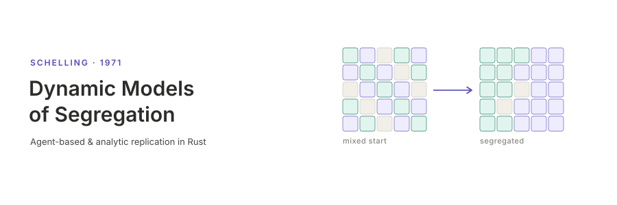

<p align="center"></p>

[English](README.md) | **日本語**

# 分居の動学モデル — Schelling (1971)

Schelling (1971) "Dynamic Models of Segregation" の3つのモデル — 空間近接モデル（2次元グリッド上のエージェント動学），境界近隣モデル（集計人口の位相平面解析），ティッピングモデル（投機・非対称を含む住宅市場応用）— を再現実装したプロジェクトです．シミュレーションは Rust，可視化ツールは Python で実装しています．

## インストールとクイックスタート

```bash
# Rust シミュレーションのビルド
cargo build --release

# 標準設定で実行 (13×16グリッド, τ=1/3, seed=42)
cargo run --release

# Python 可視化ツールのインストール (workspace ルートで実行)
uv sync

# 最新の実行結果を可視化
uv run schelling-tools visualize
```

## ドキュメント

- [ユースケース](docs/usecases.ja.md) — 本プロジェクトでできること．各ドキュメントへの入口．
- [CLI](docs/cli.ja.md) — Rust CLI：`run`，`sweep`，解析モデルの `bnm` / `bnm-basin` / `tipping` サブコマンド．
- [論文再現](docs/reproduction.ja.md) — 論文 Fig. 7–32 の一括再現ワークフロー．
- [可視化](docs/visualization.ja.md) — Python `schelling-tools` と出力の解釈．
- [アーキテクチャ](docs/architecture.ja.md) — リポジトリ構成，socsim フレームワーク，参照論文．

## ライセンス

MIT
